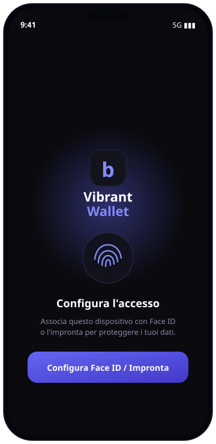
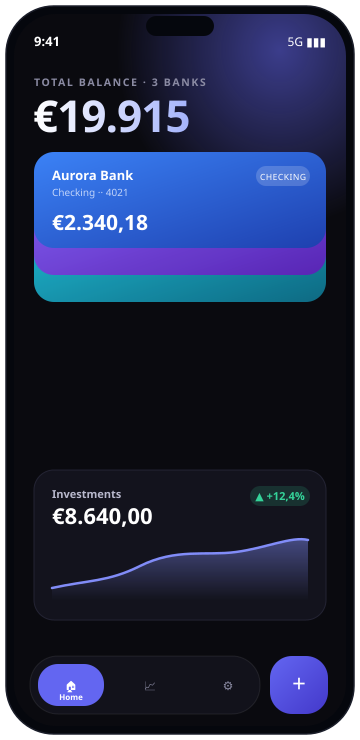
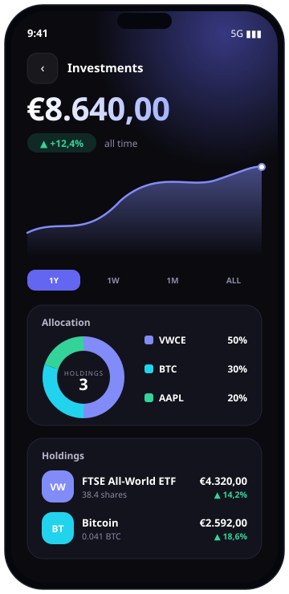

<div align="center">

# 💜 Vibrant Wallet

**Un'app di finanza personale per mobile — patrimonio netto, conti multi-banca e portafoglio investimenti, con sblocco biometrico.**

Frontend React incapsulato in un'app nativa Android/iOS con Capacitor, servito da un backend Node/Express con datastore cifrato e un'astrazione a provider pronta per l'Open Banking (PSD2).

<br/>





</div>

---

## 📖 Cos'è

Vibrant Wallet raccoglie in un'unica dashboard il saldo di più conti bancari e la performance del portafoglio investimenti, con grafici animati e un'interfaccia "dark & vibrant". L'accesso è protetto da autenticazione biometrica (Face ID / Touch ID / impronta), e i dati bancari arrivano dal backend, non sono mai cablati nell'app.

> **Nota:** in questa versione le banche sono simulate da un provider `mock` che riproduce fedelmente il comportamento di un aggregatore reale (colleghi/scolleghi conti e il patrimonio si aggiorna). L'integrazione con banche reali via PSD2 è già predisposta a livello di architettura — vedi [Collegare banche reali](#-collegare-banche-reali-psd2).

## ✨ Funzionalità

- **Patrimonio netto aggregato** su più banche + investimenti, calcolato dinamicamente sui conti effettivamente collegati.
- **Carte bancarie impilate** con gradienti, che si "aprono a ventaglio" al tocco.
- **Schermata investimenti** con grafico lineare animato (1W/1M/1Y/ALL), donut di allocazione e lista degli asset.
- **Dettaglio per banca**: saldo, andamento, spesa per categoria e ultime transazioni.
- **Gestione conti collegati**: collega/scollega una banca e il conteggio si aggiorna automaticamente.
- **Sblocco biometrico** con due percorsi (WebAuthn su web, prompt biometrico nativo + segreto su dispositivo su mobile).
- **Modalità "occhio"** per nascondere gli importi.
- **Navigazione flottante** in stile pill con pulsante d'azione.

## 🖼️ Anteprima

| Sblocco | Home | Investimenti |
|:---:|:---:|:---:|
|  |  |  |

## 🏗️ Architettura

```
finance app/
├── app/                     # Frontend (React + Vite) + shell nativa Capacitor
│   ├── src/
│   │   ├── components/       # Home, Investments, BankScreen, LockScreen, TabBar, grafici…
│   │   ├── services/         # api.js, auth.js, session.js, platform.js, deviceSecret.js
│   │   ├── data.js           # dati statici (investimenti/holdings demo)
│   │   └── index.css         # design system (tema dark & vibrant)
│   ├── android/              # progetto nativo generato da Capacitor
│   └── capacitor.config.json
└── server/                  # Backend (Node + Express)
    ├── src/
    │   ├── routes/           # auth.js, accounts.js
    │   ├── providers/        # index.js, mockProvider.js, plaidProvider.js
    │   ├── middleware/       # auth (JWT), rate limiting
    │   ├── webauthn.js       # percorso WebAuthn (web)
    │   ├── deviceAuth.js     # percorso device-secret (nativo)
    │   ├── store.js          # datastore JSON cifrato (AES-256-GCM)
    │   └── crypto.js
    └── .env.example
```

Il frontend parla col backend solo tramite gli endpoint `/api/*`; il numero di banche mostrate deriva sempre dai conti realmente collegati lato server.

## 🔐 Sicurezza

- **Autenticazione biometrica a due percorsi:** su web si usa **WebAuthn** (la chiave privata non lascia mai l'enclave sicura del dispositivo); nella build nativa il prompt biometrico è locale e al server viene inviato solo un **segreto legato al dispositivo**, conservato in Keychain/Keystore.
- **Solo un hash del segreto** (SHA-256) è persistito lato server, confrontato in tempo costante: una copia rubata del datastore non basta per forgiare un accesso.
- **Datastore cifrato a riposo** con **AES-256-GCM** (`server/data/store.enc.json`); la chiave sta nel `.env`, mai nel codice.
- **Sessioni brevi** via **JWT** (15 minuti) emessi solo dopo un login biometrico riuscito.
- Hardening di base con **helmet**, **CORS** ristretto e **rate limiting**.
- Nessun segreto è committato: `.env`, `server/data/` e gli artefatti di build sono in `.gitignore`.

## 🛠️ Strumenti di progettazione e sviluppo

| Ambito | Strumenti |
|---|---|
| **Progettazione UI/UX** | [Claude Design](https://claude.ai/design) per la prototipazione delle schermate (mockup HTML/CSS), poi handoff verso il codice |
| **Assistenza allo sviluppo** | Claude (Cowork) come pair-programmer per implementazione, debug e configurazione |
| **Frontend** | React 18, Vite, CSS puro (design system custom), SVG animati per i grafici |
| **App nativa** | Capacitor (Android/iOS), `capacitor-native-biometric`, `capacitor-secure-storage-plugin` |
| **Autenticazione** | WebAuthn (`@simplewebauthn/browser` + `@simplewebauthn/server`), JWT (`jsonwebtoken`) |
| **Backend** | Node.js, Express, Zod (validazione), Helmet, express-rate-limit, dotenv |
| **Crittografia** | Node `crypto` — AES-256-GCM, SHA-256 |
| **Open Banking** | astrazione a provider (`mock` incluso; `plaid` di riferimento; pronta per Enable Banking/PSD2) |
| **Build mobile** | Android Studio, Android Gradle Plugin 8.9.1, Gradle 8.14.3, compileSdk 36 |
| **Tipografia** | Space Grotesk + IBM Plex Sans |

## 🚀 Come eseguirlo

### 1. Backend

```bash
cd server
cp .env.example .env
# genera segreti reali:
node -e "console.log(require('crypto').randomBytes(32).toString('hex'))"   # -> ENCRYPTION_KEY
node -e "console.log(require('crypto').randomBytes(48).toString('base64'))" # -> JWT_SECRET
npm install
npm run dev        # http://localhost:8787  (provider: mock)
```

### 2. Frontend (web)

```bash
cd app
npm install
npm run dev        # apre il dev server Vite
```

### 3. Build nativa Android

```bash
cd app
# per l'emulatore, punta l'app all'host:
echo "VITE_API_BASE_URL=http://10.0.2.2:8787" > .env
npm run build
npx cap sync android
npx cap open android   # poi Run ▶ da Android Studio
```

> In sviluppo l'app usa `androidScheme: http` e una `network_security_config` che consente il traffico in chiaro verso `10.0.2.2`/`localhost`. Per la produzione: `androidScheme: https` + backend HTTPS reale. Dettagli in [`app/CAPACITOR.md`](app/CAPACITOR.md).

## 🏦 Collegare banche reali (PSD2)

Per legge (PSD2) l'accesso ai conti passa da un provider AISP licenziato. Il backend è già predisposto: basta implementare un provider che rispetti l'interfaccia `createLinkToken` / `listInstitutions` / `exchangePublicToken` / `refreshAccount` e registrarlo in `server/src/providers/index.js`.

- Provider consigliato (2026): **Enable Banking** — self-serve, gratuito per i propri conti in "Restricted Production", sandbox per i test, copertura EEA/Italia. (Il classico gratuito Nordigen/GoCardless è chiuso ai nuovi.)
- La connessione reale richiede un flusso di **consenso con redirect + SCA** alla banca e la gestione del **deep link** di ritorno nell'app.

## ⚠️ Disclaimer

Progetto personale a scopo dimostrativo/didattico. I dati bancari mostrati sono **simulati**. Non è un servizio finanziario e non gestisce denaro reale.

## 🙌 Crediti

Interfaccia prototipata con **Claude Design** e sviluppata con l'assistenza di **Claude**. Font: *Space Grotesk* e *IBM Plex Sans*.
